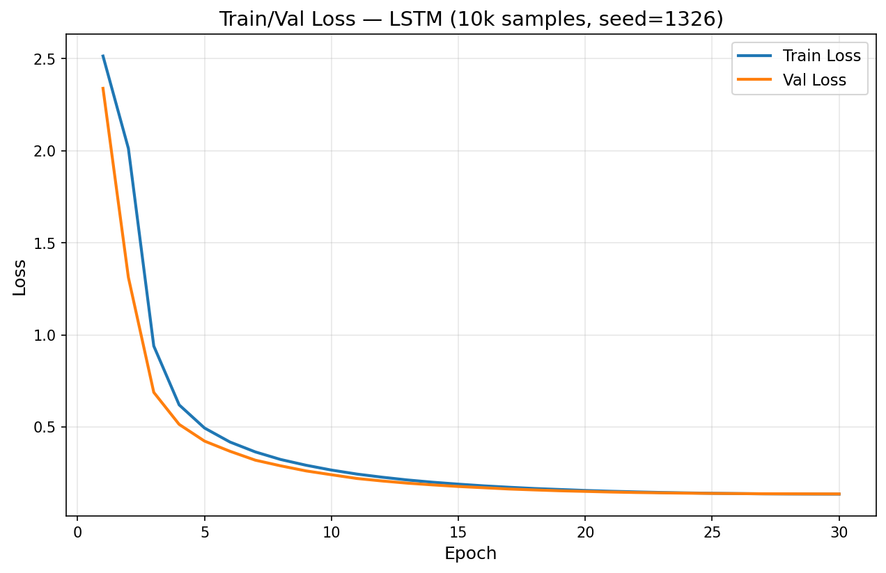
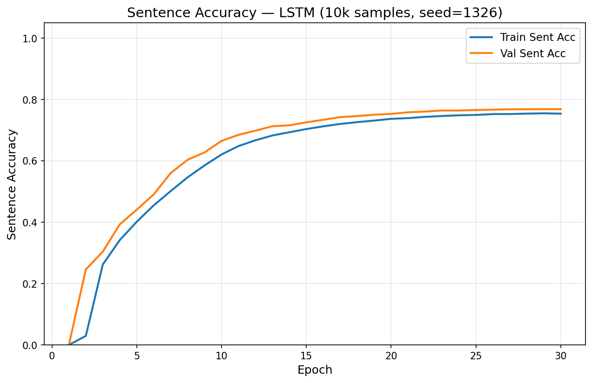
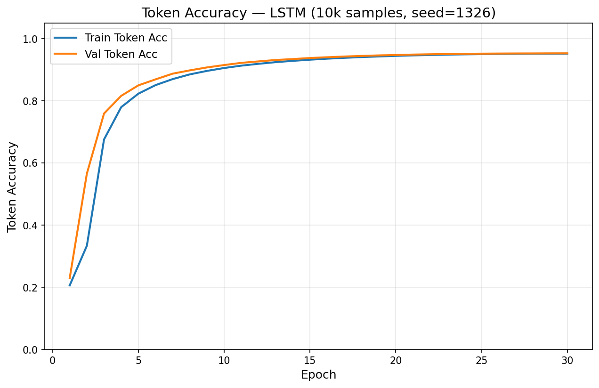
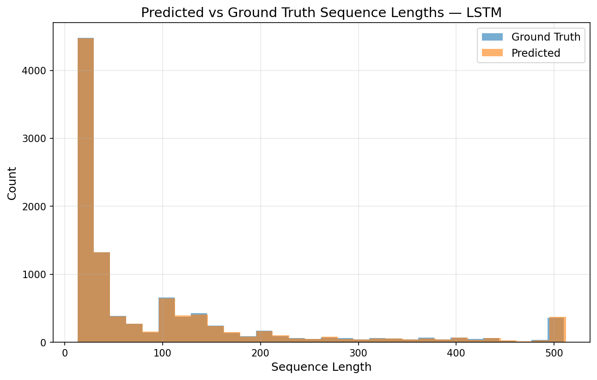
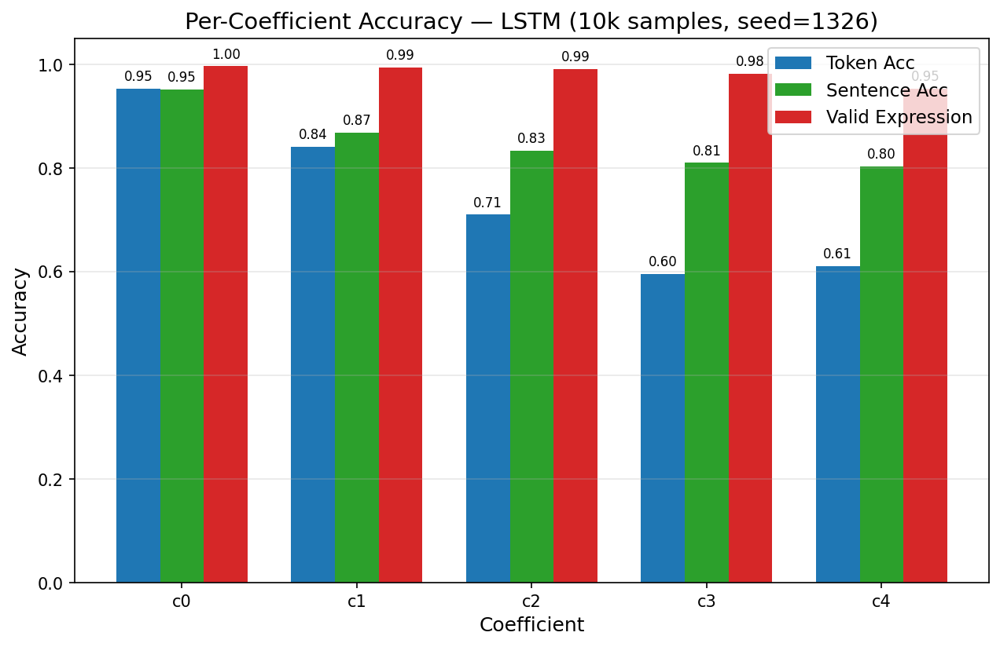
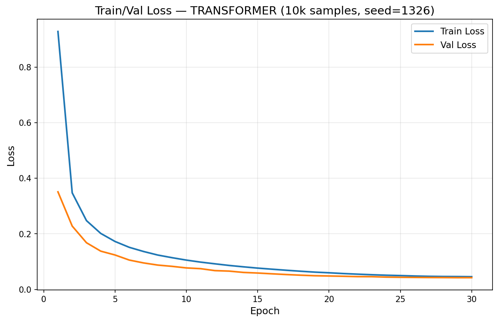
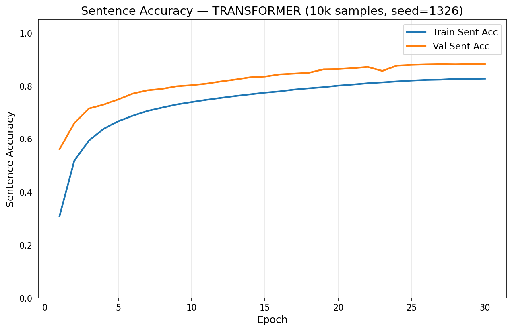
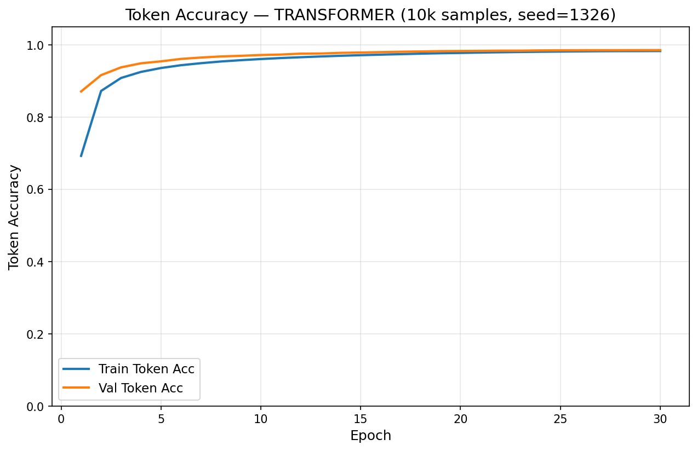
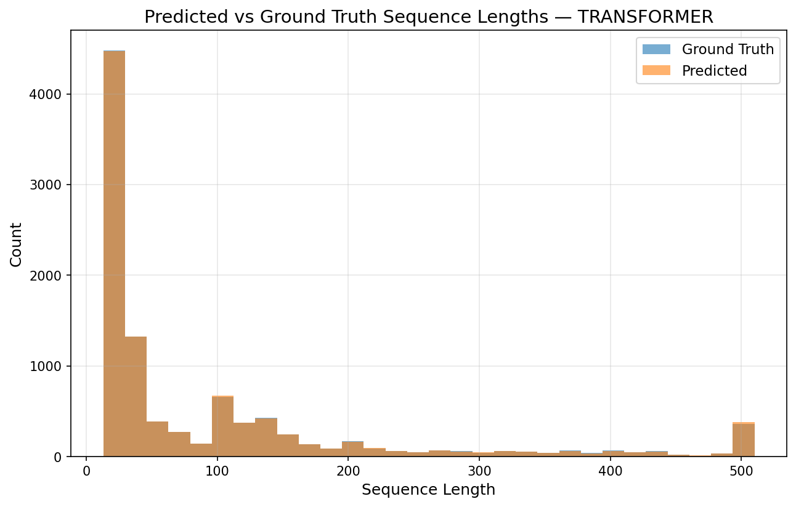
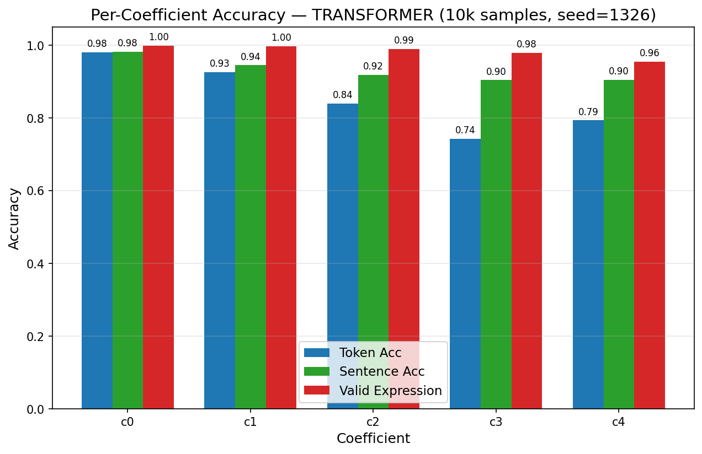

# Taylor Series Coefficient Prediction

A deep learning system for predicting Taylor series coefficients of mathematical functions using Seq2Seq models (Transformer and LSTM). Given a symbolic function `f(x)`, the model predicts 5 Taylor coefficients `(c0, c1, c2, c3, c4)` via greedy autoregressive decoding.

## Setup & Installation

### Prerequisites
- Python 3.12+
- PyTorch (tested with CUDA support)
- SymPy for symbolic mathematics
- NumPy, Pandas, Scikit-learn, Matplotlib

### Installation Steps

1. **Clone/Navigate to the project directory:**
   ```bash
   cd /path/to/taylor-series-pred
   ```

2. **Create a virtual environment (recommended):**
   ```bash
   python -m venv .venv
   source .venv/bin/activate  # On Windows: .venv\Scripts\activate
   ```

3. **Install dependencies:**
   ```bash
   pip install torch sympy numpy pandas scikit-learn matplotlib jupyter
   ```

---

## Project Overview

This project trains neural networks to predict the **Taylor series coefficients** of mathematical functions. Given a function `f(x)` as input, the model outputs all 5 Taylor coefficients `(c0, c1, c2, c3, c4)` representing:

```
f(x) ~ c0 + c1*x + c2*x^2/2! + c3*x^3/3! + c4*x^4/4!
```

### Key Design
- **Single-pass decoding**: All coefficients predicted in one sequence
- **`<BREAK>` token delimiter**: Coefficients separated by special `<BREAK>` tokens in output sequence
- **Autoregressive generation**: Greedy decoding at inference

---

## Experiment Configurations

### 100k Dataset Run

**Environment:** Kaggle GPU (T4 16GB), 9-hour session limit

#### Model Configurations

| Hyperparameter | LSTM | Transformer |
|---|---|---|
| Architecture | BiLSTM + Bahdanau attention | Encoder-decoder Transformer |
| Parameters | 5,726,208 | 6,470,400 |
| d_model | 256 | 256 |
| hidden_size | 256 | -- |
| nhead | -- | 8 |
| Encoder layers | 2 (bidirectional) | 3 |
| Decoder layers | 4 | 8 |
| dim_feedforward | -- | 256 |
| Batch size | 256 | 64 |
| Dropout | 0.1 | 0.1 |
| LR | 3e-4 | 3e-4 |
| Epochs trained | 30 | 30 |
| Seed | 1326 | 1326 |

#### Shared Training Config

| Parameter | Value |
|-----------|-------|
| Dataset | 99,443 samples (~100k) |
| Train/Val Split | 89,499 / 9,944 (90% / 10%) |
| Random Seed | 1326 |
| Optimizer | Adam (default betas) |
| Learning Rate | 3e-4 |
| Scheduler | CosineAnnealingLR (eta_min = LR * 1e-2) |
| Max Epochs | 30 |
| Early Stopping | Patience = 10 epochs |
| Gradient Clipping | 1.0 |
| Loss Function | CrossEntropyLoss (ignore_index=PAD) |
| Max Seq Length | 512 |
| Vocab Size | 29 |

#### Demo Mode

Set `DEMO_RUN = True` to run only 2 epochs for quick testing/debugging.

---

## Model Architectures

### 1. Transformer Encoder-Decoder

```
Input Function (prefix tokens)
        |
   [SOS] + encode(fn_tokens) + [EOS]
        |
+----------------------+
|   ENCODER            |
| (3 layers)           |
| d_model=256          |
| nhead=8              |
| dim_feedforward=256  |
+----------------------+
        |
+----------------------+
|   DECODER            |
| (8 layers)           |
| Autoregressive       |
+----------------------+
        |
Output: [SOS] c0 [BREAK] c1 [BREAK] ... c4 [EOS]
```

- Sinusoidal positional encoding (max 512)
- Pre-norm transformer layers
- KV-cached greedy decoding
- 6,470,400 parameters

### 2. LSTM Seq2Seq with Attention

```
Input Function (prefix tokens)
        |
   [SOS] + encode(fn_tokens) + [EOS]
        |
+--------------------------+
|   ENCODER                |
| Bidirectional LSTM       |
| (2 layers, d=256, h=256)|
+--------------------------+
        |
   Bahdanau Attention
        |
+--------------------------+
|   DECODER                |
| Unidirectional LSTM      |
| (4 layers)               |
+--------------------------+
        |
Output: [SOS] c0 [BREAK] c1 [BREAK] ... c4 [EOS]
```

- Packed sequences for variable-length inputs
- Encoder final states projected to decoder initial states
- Context vector concatenated with decoder input at each step
- 5,726,208 parameters

**Shared across both models:**
- Same vocabulary (29 tokens) and special token handling
- Same public interface: `forward()`, `generate_batch()`, `generate()`
- Same checkpoint format

---

## Tokenization

### Vocabulary (29 tokens)

| Category | Tokens | Count |
|----------|--------|-------|
| Special | `<PAD>`, `<SOS>`, `<EOS>`, `<UNK>`, `<BREAK>` | 5 |
| Variables | `x`, `a` | 2 |
| Operators | `+`, `-`, `*`, `/`, `**` | 5 |
| Digits | `0-9` | 10 |
| Functions | `sin`, `cos`, `exp`, `log`, `sqrt` | 5 |
| Delimiters | `(`, `)` | 2 |

Functions are encoded in **prefix notation** (Polish notation):
- `x^2 + 1` -> `[+, **, x, 2, 1]`

---

## Training Pipeline

### Training Loop

```
For each epoch (up to 30, with patience=10):
  1. Train on training set (teacher forcing)
  2. Validate on validation set (teacher forcing)
  3. Save checkpoint
  4. Track best val_loss, early stop if no improvement for 10 epochs

After training:
  5. Load best checkpoint
  6. Sample predictions on validation set
  7. Full autoregressive evaluation on validation set
  8. Generate all tables and figures
  9. Evaluate on 30 custom test functions (exact + SymPy match)
```

### Evaluation Metrics

| Metric | Description |
|--------|-------------|
| Token Accuracy | Fraction of non-PAD tokens predicted correctly |
| Sentence Accuracy | Fraction of sequences where ALL tokens match |
| Expression Validity | Fraction of predictions that form valid prefix expressions |
| Function-Level Accuracy | Fraction where ALL 5 coefficients are correct |
| Per-Coefficient Accuracy | Token/sentence/expression accuracy for each c0-c4 |

### Custom Test Functions

30 handpicked functions evaluated at the end with both exact-match and SymPy equivalence checking. Examples:
- `(x**2 + 1)*sin(x)`, `exp(x)*cos(x)`, `log(1 + x)`, `x/(1 - x)`, etc.

---

## Output

### Generated Tables (CSV)

| File | Contents |
|------|----------|
| `architecture_summary.csv` | Model type, param count, layer config |
| `performance_summary.csv` | Final losses, accuracies, training info |
| `per_coefficient_accuracy.csv` | c0-c4 token/sentence/expression accuracy |
| `full_run_metrics.csv` | Per-epoch: loss, token acc, sentence acc |
| `eval_functions_results.csv` | Per-function exact/sympy match results |

### Generated Figures (PNG)

| File | Contents |
|------|----------|
| `fig1_loss_curves.png` | Train/val loss over epochs |
| `fig2_sentence_accuracy.png` | Train/val sentence accuracy over epochs |
| `fig3_per_coefficient_accuracy.png` | Grouped bar chart: c0-c4 accuracy |
| `fig4_token_accuracy.png` | Train/val token accuracy over epochs |
| `fig5_sequence_lengths.png` | Predicted vs ground truth length histogram |

All outputs are saved to `experiment/{model_type}_{timestamp}/`.

---

## Project Structure

```
taylor-series-pred/
├── main.py                  # Training entry point + report generation
├── model.py                 # CoeffPredTransformer & CoeffPredLSTM
├── dataset.py               # Dataset class & vocabulary
├── dataset_generation.py    # Dataset generation utilities
├── train_validate.py        # Training/validation loops
├── metrics.py               # Evaluation metrics
├── report_logger.py         # Report logger with plot generation
├── inference.py             # Inference utilities
├── experiment/              # Experiment reports (tables + figures)
│   ├── lstm_20260312_135048/
│   └── transformer_20260312_135140/
├── checkpoints/             # Saved model checkpoints
│   ├── epoch_NNN.pt
│   └── taylor_series_pred_{model_type}.pt
└── notebook/                # Jupyter notebooks
```

---

## Quick Start

```bash
# Full training run
python main.py  # Edit MODEL_TYPE in main.py: "transformer" or "lstm"

# Demo run (2 epochs)
# Set DEMO_RUN = True in main.py, then:
python main.py
```

### Customization

Edit the configuration section in `main.py`:

```python
DEMO_RUN = False          # True for 2-epoch test run
MODEL_TYPE = "transformer"  # "transformer" or "lstm"
RANDOM_SEED = 1326
NUM_EPOCHS = 30
PATIENCE = 10             # Early stopping patience
BATCH_SIZE = 64
LR = 3e-4
```

---

## Results

### 1. Overall Performance

| Metric | LSTM | Transformer | Delta |
|---|---|---|---|
| Final train loss | 0.1357 | 0.0457 | -0.090 |
| Best val loss | 0.1368 | **0.0421** | **-0.095** |
| Val token accuracy | 0.6140 | **0.7833** | **+0.169** |
| Val sentence accuracy | 0.7686 | **0.8825** | **+0.114** |
| Val function-level acc | 0.7686 (7643/9944) | **0.8825** (8776/9944) | **+0.114** |
| Expression validity | 0.9835 | 0.9838 | ~0 |
| Custom test exact | 8/30 (26.7%) | **22/30 (73.3%)** | **+46.7 pp** |

---

### 2. Per-Coefficient Accuracy

| Coeff | LSTM tok | Transformer tok | LSTM sent | Transformer sent | LSTM valid | Transformer valid |
|---|---|---|---|---|---|---|
| c0 | 0.9532 | **0.9808** | 0.9521 | **0.9822** | 0.9964 | **0.9988** |
| c1 | 0.8409 | **0.9262** | 0.8688 | **0.9449** | 0.9944 | **0.9967** |
| c2 | 0.7102 | **0.8396** | 0.8336 | **0.9189** | **0.9917** | 0.9897 |
| c3 | 0.5958 | **0.7421** | 0.8100 | **0.9042** | **0.9817** | 0.9788 |
| c4 | 0.6115 | **0.7935** | 0.8027 | **0.9050** | 0.9535 | **0.9550** |

---

### 3. LSTM Training Curves & Figures

| Loss Curves | Sentence Accuracy |
|:-----------:|:-----------------:|
|  |  |

| Token Accuracy | Sequence Length Distribution |
|:--------------:|:---------------------------:|
|  |  |

#### Per-Coefficient Accuracy



---

### 4. Transformer Training Curves & Figures

| Loss Curves | Sentence Accuracy |
|:-----------:|:-----------------:|
|  |  |

| Token Accuracy | Sequence Length Distribution |
|:--------------:|:---------------------------:|
|  |  |

#### Per-Coefficient Accuracy



---

### 5. Epoch-Level Training Log

| Epoch | LSTM trn_loss | LSTM val_loss | LSTM val_sent | Transformer trn_loss | Transformer val_loss | Transformer val_sent |
|---|---|---|---|---|---|---|
| 1 | 2.5142 | 2.3388 | 0.000 | 0.9278 | 0.3509 | 0.562 |
| 2 | 2.0126 | 1.3125 | 0.246 | 0.3473 | 0.2277 | 0.660 |
| 3 | 0.9399 | 0.6883 | 0.304 | 0.2474 | 0.1678 | 0.715 |
| 5 | 0.4945 | 0.4236 | 0.441 | 0.1805 | 0.1245 | 0.774 |
| 10 | 0.2663 | 0.2409 | 0.665 | 0.1327 | 0.0821 | 0.833 |
| 15 | 0.1899 | 0.1771 | 0.726 | 0.0893 | 0.0601 | 0.860 |
| 20 | 0.1556 | 0.1505 | 0.753 | 0.0680 | 0.0506 | 0.873 |
| 25 | 0.1402 | 0.1395 | 0.766 | 0.0551 | 0.0452 | 0.879 |
| 29 | 0.1361 | 0.1370 | 0.768 | 0.0461 | 0.0421 | 0.882 |
| 30 | 0.1357 | 0.1368 | 0.768 | 0.0457 | 0.0422 | 0.883 |

---

### 6. Custom Test Function Results (30 functions, x/5 coefficients exact)

| # | Function | LSTM | Transformer | Delta |
|---|---|---|---|---|
| 1 | (x^2+1)*sin(x) | 2/5 | 2/5 | = |
| 2 | x^3*cos(2x) | 1/5 | 3/5 | +2 |
| 3 | exp(x)*(1+x) | 3/5 | 5/5 | +2 |
| 4 | x*exp(2x) | 4/5 | 5/5 | +1 |
| 5 | (1+x^2)*exp(-x) | 1/5 | 1/5 | = |
| 6 | exp(x)*sin(x) | 5/5 | 5/5 | = |
| 7 | log(1+x) | 5/5 | 5/5 | = |
| 8 | log(1+x^2) | 4/5 | 5/5 | +1 |
| 9 | x*log(1+x) | 3/5 | 5/5 | +2 |
| 10 | x/(1-x) | 5/5 | 5/5 | = |
| 11 | x/(1+x) | 5/5 | 5/5 | = |
| 12 | 1/(1+x^2) | 2/5 | 5/5 | +3 |
| 13 | x^2/(1-x) | 2/5 | 5/5 | +3 |
| 14 | sin(x^2) | 5/5 | 5/5 | = |
| 15 | exp(x^2) | 5/5 | 5/5 | = |
| 16 | cos(sqrt(1+x)) | 2/5 | 5/5 | +3 |
| 17 | log(1+sin(x)) | 4/5 | 5/5 | +1 |
| 18 | (x+1)*exp(x) | 3/5 | 5/5 | +2 |
| 19 | x^2*log(1+x) | 1/5 | 3/5 | +2 |
| 20 | exp(x)*cos(x) | 5/5 | 5/5 | = |
| 21 | exp(x)*(x^2+1) | 2/5 | 5/5 | +3 |
| 22 | sin(x)*cos(x) | 5/5 | 5/5 | = |
| 23 | log(1+x^3) | 2/5 | 5/5 | +3 |
| 24 | log(1+x)*cos(x) | 1/5 | 3/5 | +2 |
| 25 | x*exp(x)*sin(x) | 1/5 | 4/5 | +3 |
| 26 | x*exp(x)*cos(x) | 3/5 | 5/5 | +2 |
| 27 | sqrt(1+x)*sin(x) | 1/5 | 3/5 | +2 |
| 28 | sqrt(1+x)/(1+x) | 2/5 | 5/5 | +3 |
| 29 | cos(x)/(1+x) | 2/5 | 5/5 | +3 |
| 30 | exp(x)/(1+x) | 1/5 | 1/5 | = |
| **Total** | | **40/150 (26.7%)** | **110/150 (73.3%)** | **+46.7 pp** |

Functions where both models tied at 5/5: #6, 7, 10, 11, 14, 15, 20, 22 -- all relatively low-complexity (pure trig, log, or rational forms without deeply nested composition). Functions where both fail: #1 (trig x polynomial, high-order), #5 (polynomial x decaying exp), #30 (exp/rational quotient with rapidly growing derivatives).

---

### 7. Key Observations

**Convergence.** The Transformer reaches a val loss of 0.042 vs the LSTM's 0.137 -- roughly 3x lower -- despite both training for 30 epochs. The LSTM converges fast in early epochs (val_sent_acc jumps from 0 to 0.77 within ~5 epochs) but then plateaus, while the Transformer continues improving steadily through epoch 29.

**Function-level accuracy.** The 11.4 pp gap on the validation set (88.3% vs 76.9%) grows to 46.6 pp on the custom set, indicating that the LSTM's representations generalise less well to out-of-distribution compositional forms.

**Expression validity is model-agnostic.** Both sit at ~98.4%, meaning both models reliably emit syntactically valid SymPy expressions. All accuracy differences are in semantic correctness of the predicted coefficients.

**Higher-order coefficients degrade more for LSTM.** The token-accuracy drop from c0->c4 is 0.953->0.612 (LSTM) vs 0.981->0.794 (Transformer). The Transformer's cross-attention can re-read any encoder position at each decode step; the LSTM must compress the source into a fixed-size hidden state passed through Bahdanau attention, which appears insufficient for the longer dependency chains required by higher derivatives.

**Custom test failure modes differ.** LSTM errors are mostly off-by-one constant offsets in the numerator (e.g. predicts `3*exp(a)` where ground truth is `4*exp(a)`), suggesting the recurrent decoder loses count of accumulated derivative terms. Transformer errors concentrate in cases with rapidly growing coefficient magnitudes (fn #30: `exp(x)/(1+x)`) where both models fail entirely.

---

## Notes

- Prefix notation (Polish notation) for all expressions
- `<BREAK>` tokens delimit coefficients in the output sequence
- Teacher forcing during training; autoregressive decoding for evaluation
- Sequences > 512 tokens are filtered out
- Best checkpoint selected by validation loss
- Early stopping with patience=10 prevents overfitting
